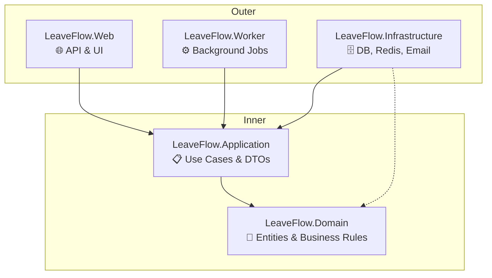

# LeaveFlow Architecture

## Overview

LeaveFlow follows **Clean Architecture** (Ports and Adapters) to ensure business logic remains independent of frameworks, UI, and databases.

## Dependency Graph

Dependencies point **inward**. Outer layers depend on inner layers. Inner layers know nothing of outer layers.

## Project Responsibilities

| Project            | Responsibility                           | Dependencies                |
| ------------------ | ---------------------------------------- | --------------------------- |
| **Domain**         | Business entities, value objects, events | **None** (Pure C#)          |
| **Application**    | Use cases, interfaces, DTOs              | Domain                      |
| **Infrastructure** | EF Core, Redis, Hangfire, Email          | Application, Domain         |
| **Web**            | HTTP endpoints, HTMX, Controllers        | Application                 |
| **Worker**         | Background job processing                | Application, Infrastructure |

## Golden Rules

1.   **Domain Isolation**: `LeaveFlow.Domain` must **never** reference any other project. No EF Core, no ASP.NET, no JSON libraries.
2.   **Interface Segregation**: `Application` defines interfaces (ports). `Infrastructure` implements them (adapters).
3.   **Dependency Direction**: `Web` depends on `Application`, NOT `Infrastructure`. Dependency Injection wires implementations at runtime.

## Enforcement

- **Manual**: Code review checks project references.
- **Automated** (Future): ArchUnit tests will fail build if forbidden dependencies are detected.
